# WAFRN OCI OpenTofu scripts

Oracle Resource Manager compatible terraform / opentofu scripts to deploy a small but production-ready WAFRN instance to Oracle Cloud Infrastructure using only Always Free tier eligible instances

## Magic deploy quick install guide

[![Deploy to Oracle Cloud][magic_button]][magic_wafrn_basic_stack]

Requirements:

1. A domain name you control
2. Around 15 minutes

Steps to install:

1. Register for a new account on [Oracle Cloud](https://signup.cloud.oracle.com/)
2. Login and then press the Magic deploy button above
3. Fill in the details
4. Make sure to click "Apply" at the end
5. Wait until installation is finished
6. Update your domain DNS settings based on the instructions
7. Wait a bit more
8. PROFIT!

You can also deploy this repository manually by setting up the `.tfvars` by hand then running the directory throgh `tofu apply` or `terraform apply`

## Install guide

### Registration

You can [register for Oracle Cloud here](https://signup.cloud.oracle.com/). Email might be slow to arrive. Please note you need to enter your real legal name and address during signup as it will be verified against the credit card / debit card details. Entering fake details will likely fail verification.

When it comes to the Home Region selector make sure you select a region that you're happy that your data will reside in. It might also have some legal implications, for example selecting regions in the EU will definitely require you to abide to GDPR regulations, as well as any local regulations in that specific country.

There are some other considerations to look for, for example the server's location is used to generate link previews, so any resource that the server cannot access to will lack previews for everyone. For example if you select a location in Germany as your Home Region the server will not be able to access any YouTube videos that are blocked in Germany.

Also there might be warnings about low resources in some regions. It is advised to avoid them unless necessary.

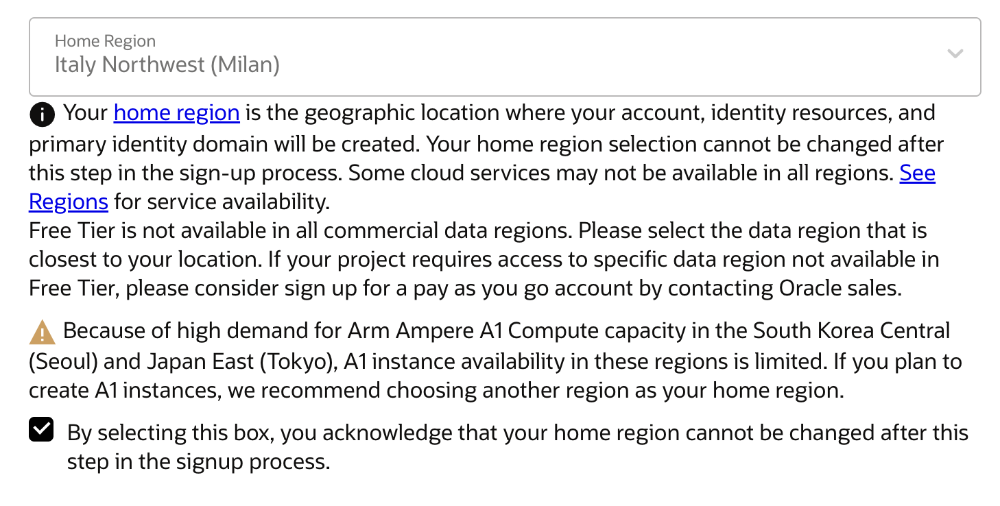

### Stack init

#### Magic Button

Click the below magic button to initiate your wafrn stack:

[![Deploy to Oracle Cloud][magic_button]][magic_wafrn_basic_stack]

#### Terms and Conditions

Accept the terms and conditions

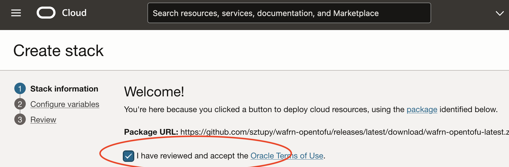

Then click NEXT on the bottom of the page

#### Enter configuration

Next page is where you need to fill in your configuration. The following are the only mandatory details you need to fill in:

* WAFRN Domain name
* Administrator email address
* Administrator username
* Enable/Disable Bluesky integration
* Bluesky domain name and admin user's handle

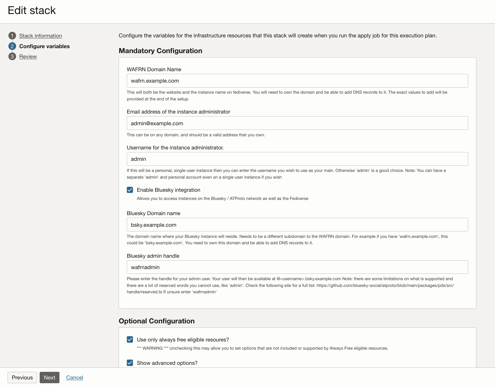

You can also check "Show advanced options?" to enable/disable extra features. Please check the [Features section](#features) for mode details on these options. While the defaults are good as a basic setup you might want to go through the rest as well.

Once you finish click NEXT on the bottom of the page again.

#### Apply

On the final page double check that everything still makes sense. If yes, at the bottom of the page make sure "Run Apply" is selected, then click "CREATE"

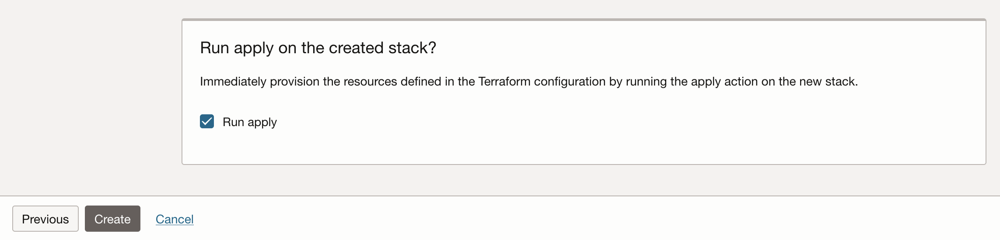

(Forgot to enable "Run Apply"? You can click Apply separately on the next page)

Wait for Apply to finish. This can take somewhere between 5-10 minutes. You want to have it run successfully:

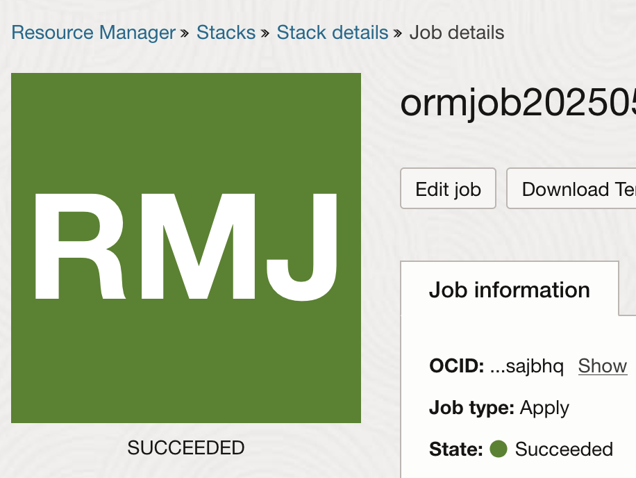

If this is in red, and doesn't say "SUCCEEDED" then check the logs for any errors.

#### DNS Settings

Final bit is updating your DNS config. Make sure to "Copy" the DNS settings generated from the "Application Information" page:

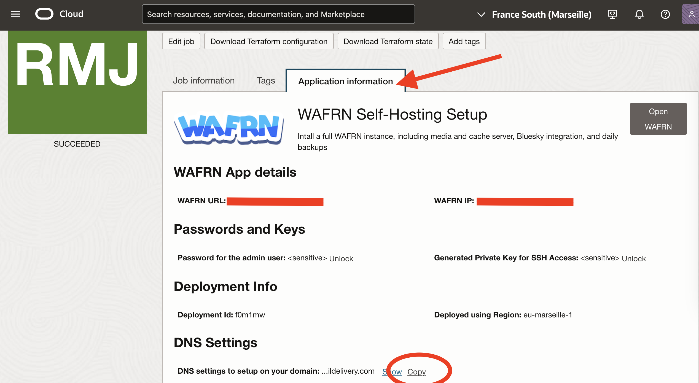

Save the contents to a new file, for example `dns_update.txt`. The contents should look something like:

```
wafrn.example.com. A 169.254.10.11
bluesky.example.com. A 169.254.10.11
*.bluesky.example.com. A 169.254.10.11
wafrn.example.com. TXT "v=spf1 include:rp.oracleemaildelivery.com include:ap.rp.oracleemaildelivery.com include:eu.rp.oracleemaildelivery.com ~all"
abcdeFGHijKLmnOP._domainkey.wafrn.example.com. CNAME abcdeFGHijKLmnOP.wafrn.example.com.dkim.mrs1.oracleemaildelivery.com.
```

Note: make sure every single domain in the file above ends in a `"."` for example `abcdeFGHijKLmnOP.wafrn.example.com.dkim.mrs1.oracleemaildelivery.com.` The `"."` is important. Not having that will cause issues during domain setup.

Once this file is saved open up the management config website of your DNS provider and import the file above.

#### Final touches

If all is well, after a couple more minutes you should be able to access your website on the domain configured by pressing the "Open WAFRN" button. If it doesn't work you either need to wait a bit more, or check [the logs](#logging) to see what's up. While you wait please double check [your email](#emails-dont-work) and [on-site backup](#on-site-backups-dont-work) settings.

To login you can obtain the administrator password from the same page you got your DNS settings.

** Congratulations and Happy WAFRNing! **


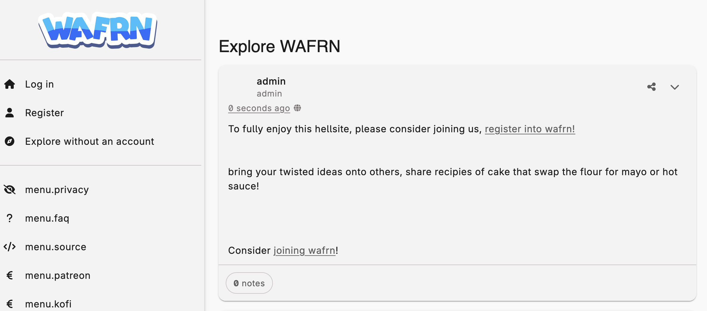

### Oracle Cloud Shell

OCI has a built-in shell that you can use to connect to and manage instances. To access click on the Cloud Shell button in the corner:

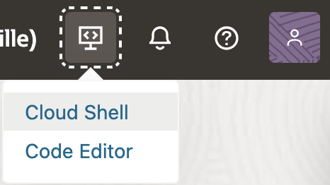

There is a small management interface you can download:

```bash
wget https://raw.githubusercontent.com/sztupy/wafrn-opentofu/refs/heads/main/scripts/wafrn.sh
chmod 755 wafrn.sh
```

Next if you allowed the stack to install the SSH keys automatically you can set it up using:

```bash
./wafrn.sh init
```

If you have provided a public key by yourself you will need to install the relevant private key manually.

Once keys are installed either way you can do the following:

#### Connect

```bash
./wafrn.sh connect
```

#### Connect with sudo access

This will connect to the instance as the `wafrn` user using SSH

```bash
./wafrn.sh connect_sudo
```

#### Creating backups

This will connect to the instance using SSH to a user with sudo access

```bash
./wafrn.sh backup
```

#### Updating the application

This will generate a new backup and upload it to the on&offsite backups if required

```bash
./wafrn.sh backup
./wafrn.sh update
```

This will first backup the current system, then update the application. Once updated it will start showing fresh logs so you can double check all looks good

#### Restoring backup

```bash
./wafrn.sh restore <backup_location>
```

This allows you to restore a specific backup. Note: you need to copy/download the backup to the box first

#### PDS (Bluesky) Admin

```bash
./wafrn.sh pdadmin <command> <parameters>
```

This supports some PDS administrative features. Check [Bluesky](#bluesky) on valid options

### Update Wafrn

If you don't want to use the Cloud Shell's management tools you can also backup and update manually:

1. Connect to your instance through ssh. Either follow the Cloud Shell setup above, or manually using openssh, PuTTY or similar tools

2. Run the following:

```bash
sudo su -l wafrn
~/wafrn/install/manage.sh backup
~/wafrn/install/manage.sh update
```

### Update / Change infrastructure setup

**WARNING** Blindly updating the infrastrucute can cause massive data loss. Make sure you create an **off-site** backup before doing this, as you can get your stack deleted.

To update your infrastucture you can manually upload a fresh Opentofu config:

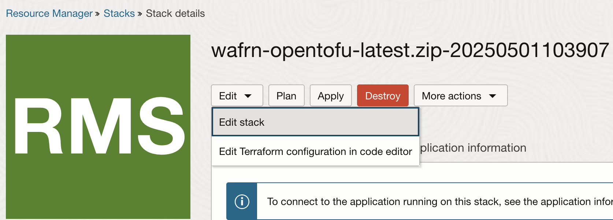

Afterwards you need to download the latest zip file from the Releases page here on GitHub, and upload it over at OCI. The steps afterwards are similar to what you have done during initial setup but it is advised **NOT** to "Run Apply". Instead click "Plan" on the next page and manually check all the changes that the system want to do. If in doubt reach out to us in the [Wafrn Discord](https://discord.gg/EXpCBpvM) to get support.

Note: not all features can be updated later. For example to update SMTP settings, or to set up or change the backup settings you will need to manually update the settings on the box.

### Deleting the stack

To delete your wafrn stack and free up all resources used by wafrn:

1. If you have on-site backups enabled you need to manually delete your on-site backup Bucket. You can do this from the OCI console by going to the buckets.

2. Once it is deleted go to your Stack, and press the Destroy button.

3. Wait for it to go green

4. If it finishes successfully (don't forget you need to delete the on-site backup bucket manually), you can also click "More Actions" -> "Delete Stack" to finish cleanup

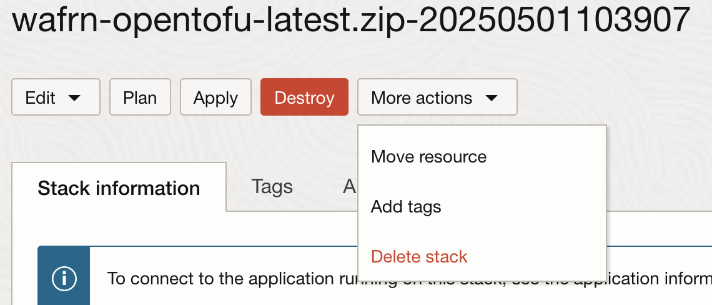

**Note:** You need to do "Destroy" first to clean up resources. If you "Delete Stack" without running "Destroy" your instances, network setup, additional users, buckets, email settings, ip addresses etc. will still keep running, consume resources and need to be cleaned up manually

## Features

The following features are included and will be deployed by the package:

### Wafrn

This is the core feature you wanted to install, right?

### Bluesky

This is the additional packages needed to enable the Bluesky integration within Wafrn. This includes installing a separate PDS server and the required setup to connect to it.

To help manage Bluesky you can use the following commands from OCI Cloud Shell:

Some examples:

```bash
./wafrn.sh pdsadmin add-insert-code # Inject a new invite code to the system someone can use to enable Bluesky for them
./wafrn.sh pdsadmin list-users # List all of the users enabled for Bluesky
./wafrn.sh pdsadmin user-reset-password <did> # Resets the credential for a specific did
```

Check [this page on Wafrn GitHub](https://github.com/gabboman/wafrn/tree/main/install/bsky) to see all options

### Emails

By default the stack will use OCI's email sending feature to send emails. For it to work you will need to add proper DCIM and SPF policies to your DNS setting, which are included in the DNS setup phase.

Note: the free tier only allows 100 emails a day, so it's preferred to have "Send pre-activation emails" disabled as it could be misused by attackers spamming the system and going over this limit easily.

You can also provide your own SMTP config if you have something better, or disable email sending completely.

### On-site backups

By default the stack will enable on-site backups which will save the database, upload folder and pds details (if bluesky is enabled) into an S3 compatible bucket. Backups will happend each day at around 3am UTC. Backup is limited to the pre-set days, and the script also tries to make sure you're not going over the free limit of 10GB by deleting large backup files (likely media ones) before uploading a new set.

### Off-site backups

You can also enable off-site backups, by specifying credentials for an S3 compatible bucket outside of OCI. This can be used as a safeguard as it's known that Oracle might delete stacks running on Always Free instances occasionally, which includes the on-site backups as well.

These off-site backups would allow you to restore your system even if the on-site backups get destroyed.

Alternatively you can set up backup scripts on your personal computer to download the on-site backups every day. You can obtain the `s3cmd` config file from your instance, it will be named `/home/wafrn/onsite.s3cfg` and set up some kind of cron on UNIX or [scheduled task](https://medium.com/@ogonnannamani11/how-to-use-windows-task-scheduler-to-automate-local-directory-sync-with-aws-s3-7fd1ccb79c6) on Windows machines that would sync the S3 backups every day.

### Logging

The following data are uploaded to [OCI's logging interface](https://cloud.oracle.com/logging/logs):

* Installation logs
* Syslogs, including cron
* Docker container logs, including logs for the backend, frontend, database and PDS instance

## FAQ

### Is this really free?

You need a domain name you control which you might get for free, but usually they cost a few of your local currency each year. You also need to accept Oracle Cloud Infrastructure's Terms and Conditions which might or might not sell your soul to the devil. A small price to pay though.

Also you will need a Credit or Debit card during the signup for verification, and around $1/£1/€1 will be locked on it during the verification process which will be refunded later.

### I've heard Oracle occasionally deletes Always Free setups

Yes, hence it's advised to keep both on-site and also setup off-site backups. You can also upgrade your account from a free tier to a pay-as-you-go tier. It will still be free if you don't go over the Always Free tier limits, but after upgrade there's a chance that you can get billed if you go over some kind of limit. It is generally advised to keep an eye out on billling and to assign a credit/debit card to your billing with low limits.

### Emails don't work

Go to [Email Domains](https://cloud.oracle.com/messaging/email/email-domains) on the cloud platform. Select your actice domain then check DKIM settings. If it's not "Active" then double check the DNS config that all is well. Make sure for example that the CNAME setting for DKIM point to Oracle's server and not to a local link

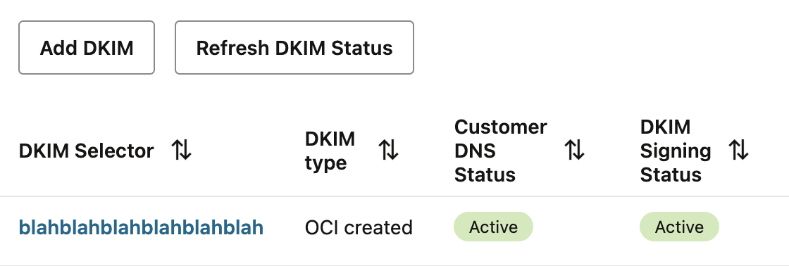

### On-site backups don't work

Go to [Tenancy Details](https://cloud.oracle.com/tenancy) on the cloud platform. Check that the "Amazon S3 compatibility API designated compartment" setting points to "<your_cloud_name> (root)". If not, click "Edit Object Storage Settings", then select your "<your_cloud_name> (root)" compartment for both options:

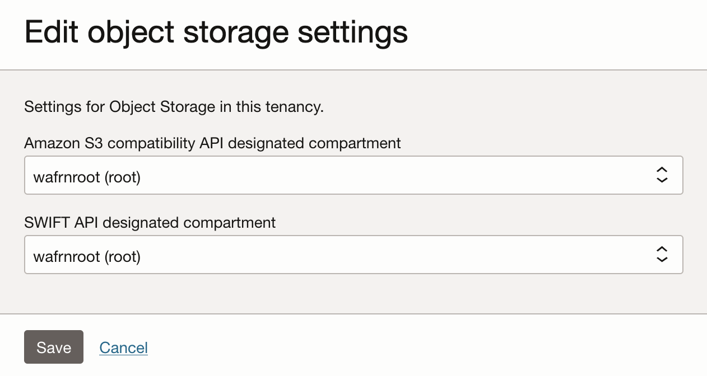

(Note: there is likely only one single option you can select for both. Do that)

# LICENSE

Licensed under the AGPLv3

Files are based on [Oracle's Always Free CloudNative example](https://github.com/oracle-quickstart/oci-cloudnative/tree/master/deploy/basic) licensed under the UPL 1.0

[magic_button]: https://oci-resourcemanager-plugin.plugins.oci.oraclecloud.com/latest/deploy-to-oracle-cloud.svg
[magic_wafrn_basic_stack]: https://cloud.oracle.com/resourcemanager/stacks/create?zipUrl=https://github.com/sztupy/wafrn-opentofu/releases/latest/download/wafrn-opentofu-latest.zip
